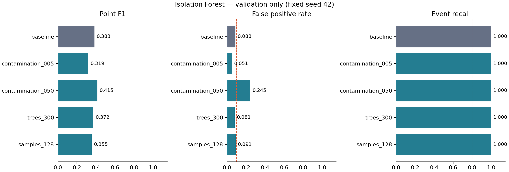

# Результаты серии 26 сентября 2026 года

Выполнены **5 реальных runs на validation и 1 отдельный final_test** в MLflow. По заранее зафиксированному правилу выбрана **baseline**. На test найдены **9/9 инцидентов**, но FPR = **13,27%**, выше цели ≤10%. Следовательно, все критерии CASE.md пока не достигнуты; эту модель нельзя объявлять прошедшей проверку качества.

Код и [протокол](PROTOCOL.md) зафиксированы до запусков коммитом `f94947c6c36e4f93be46dce5c861d434b672a894`, рабочее дерево было чистым. Seed модели и данных — 42. Python 3.12.14, scikit-learn 1.6.1, MLflow 3.16.1; остальные версии и хеши исходников находятся в [summary.json](summary.json). Dataset ID: `d217ec5fdcd8799f0ad34c238b71478ab8ee4d40c68a760a72fb7c68c0d429ac`, совпадает с эталоном #7. Перед обучением пройдены все 20 проверок #8.

## Сравнение на validation

Каждая строка — одна конфигурация, три независимые модели по таблицам. Во всех случаях 2016 наблюдений, 207 аномальных, 1809 нормальных, 9 инцидентов. Precision/recall/F1 — по наблюдениям; event recall — по интервалам.

| Конфигурация | contamination | Деревья | max_samples | Precision | Recall | F1 | FPR | Инциденты | Медиана задержки резких событий, тики | Цели выполнены |
|---|---:|---:|---:|---:|---:|---:|---:|---:|---:|---|
| **baseline** | 0.01 | 100 | 256 | 35,22% | 42,03% | **0,3833** | **8,84%** | 9/9 | 0 | Да |
| contamination_005 | 0.005 | 100 | 256 | 38,00% | 27,54% | 0,3193 | 5,14% | 9/9 | 0,5 | Да |
| contamination_050 | 0.05 | 100 | 256 | 27,73% | 82,13% | 0,4146 | 24,49% | 9/9 | 0 | Нет |
| trees_300 | 0.01 | 300 | 256 | 35,53% | 39,13% | 0,3724 | 8,13% | 9/9 | 0 | Да |
| samples_128 | 0.01 | 100 | 128 | 32,79% | 38,65% | 0,3548 | 9,07% | 9/9 | 0,5 | Да |

`contamination=0.05` даёт наибольший F1, но нарушает ограничение FPR и исключается правилом выбора. Среди допустимых вариантов baseline имеет максимальный F1. Выбор сохранён до вычисления предсказаний на test; после раскрытия test он не менялся.

**Наиболее влиятельный из исследованных параметров — contamination.** Снижение 0.01 → 0.005 меняет F1 на −0,0639, а FPR на −3,70 процентного пункта. Повышение до 0.05 меняет F1 на +0,0314, но FPR растёт на +15,64 п.п. Для сравнения, 100 → 300 деревьев меняет F1 на −0,0108, max_samples 256 → 128 — на −0,0285. Увеличение числа деревьев в этой серии не улучшило F1. Event recall равен 100% у всех вариантов и сам по себе их не различает. Это локальные однофакторные сравнения на одном seed, а не глобальный рейтинг важности гиперпараметров.

## Единственная финальная оценка на test

Baseline: contamination=0.01, n_estimators=100, max_samples=256, seed=42; scaler и модели не переобучались после validation.

| Метрика | Результат | Цель CASE.md |
|---|---:|---|
| Обнаруженные инциденты | **9/9 (100%)** | ≥80% — выполнена |
| Ложные сигналы вне инцидентов | **240/1809 (13,27%)** | ≤10% — **не выполнена** |
| Медиана задержки резких событий | **0 тиков** | ≤1 — выполнена |
| Медиана задержки всех обнаруженных событий | 0 тиков | Дополнительная метрика |
| Precision по наблюдениям | 27,71% | Цель не задана |
| Recall по наблюдениям | 44,44% | Цель не задана |
| F1 по наблюдениям | 0,3414 | Цель не задана |
| TP / FP / FN / TN | 92 / 240 / 115 / 1569 | 2016 наблюдений |

Медиана скрывает отдельные поздние сигналы: скачок объёма `users` обнаружен через **5 тиков (75 минут)**, `orders` — через **2 тика (30 минут)**. Остальные семь инцидентов — на первом тике. [Все события и задержки](test-events.json) сохранены явно; 100% обнаружения не означает мгновенную реакцию на каждое событие.

FPR вырос с 8,84% на validation до 13,27% на более позднем test. Возможная причина — смещение распределения абсолютного row_count при росте таблиц; это гипотеза для отдельного исследования, не доказанный результат этой серии. Датасет синтетический и содержит всего девять событий на период, поэтому выводы не переносятся автоматически на реальные БД.

## Что сохранено

- [summary.json](summary.json) — точные метрики, выбор, run IDs, версии и хеши.
- [comparison.csv](comparison.csv) — машиночитаемое сравнение пяти конфигураций.
- [mlflow-export.zip](mlflow-export.zip) — шесть завершённых runs со всеми моделями, предсказаниями, манифестами, отчётами проверки данных и графиком, около 11 МБ.
- [mlflow-export.sha256](mlflow-export.sha256) — контрольная сумма архива.
- [Инструкция повторения и импорта](README.md).

| Run | Исходный MLflow run_id |
|---|---|
| baseline | `269a806ac22140419c89186ee059eddb` |
| contamination_005 | `de47c791976c44e19f378867d8be6479` |
| contamination_050 | `8db34b27b6ce425c87414395b90f845f` |
| trees_300 | `3df0d7f2114a4197ae9bec286e41a091` |
| samples_128 | `8aad775256884739a0dcd4105cde9fdc` |
| final_test | `36db7cd846c94d05897732aa3eec448d` |

## Следующий шаг

В #10 закрепить определения метрик и проверки качества модели, включая отрицательный результат проверки FPR. Успешное выполнение программных тестов не означает прохождение целевых метрик модели. Для следующей исследовательской серии заранее определить изменения признаков/порогов и новый закрытый тестовый период; исследовать ложные сигналы на train/validation. Не выбирать задним числом contamination=0.005 по уже раскрытому test и не ослаблять критерий 10% ради положительного отчёта.
